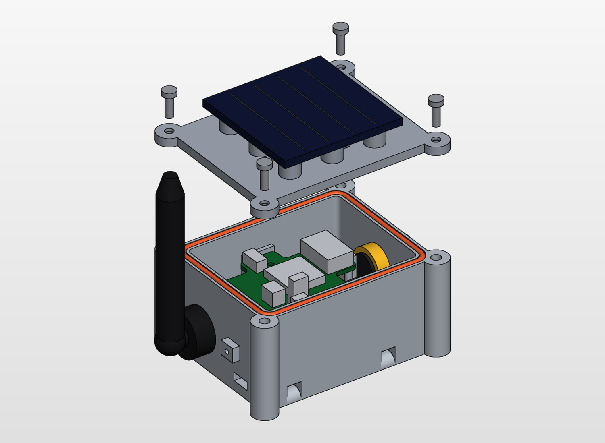
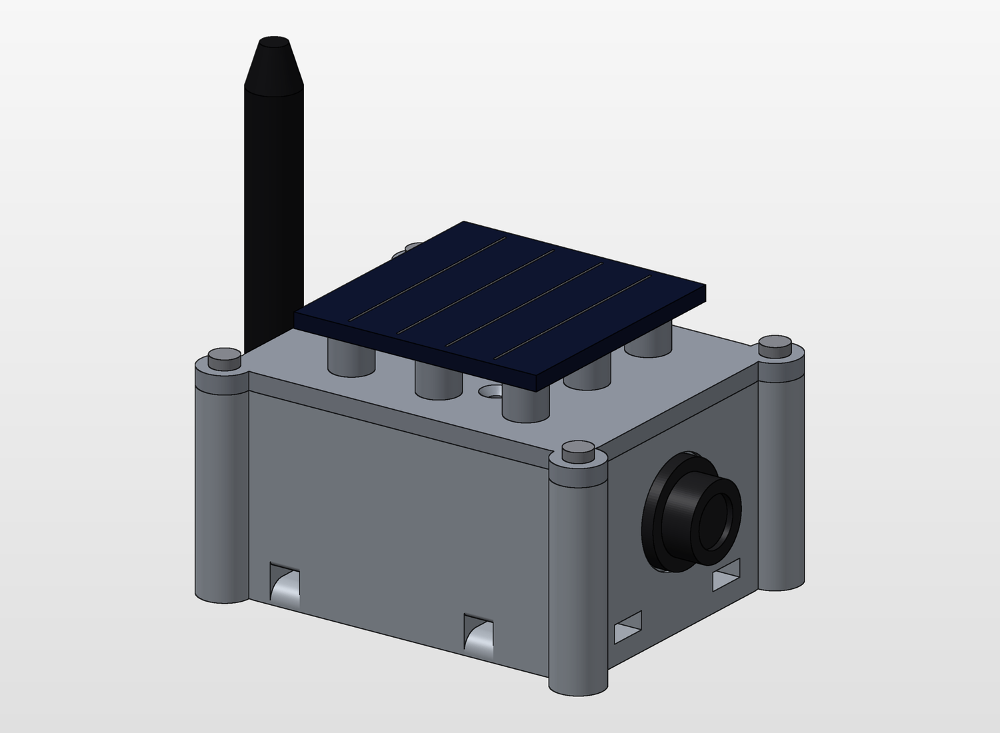
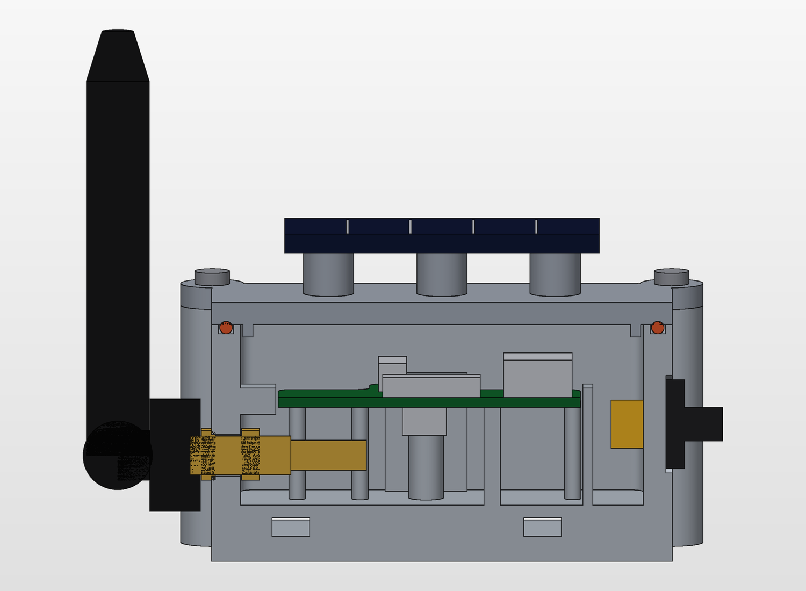
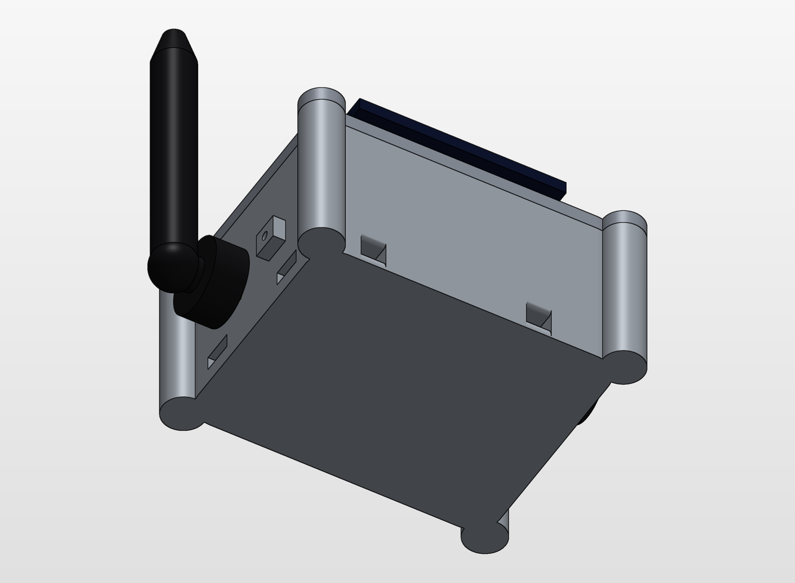

## What is this thing?

This is a box for the PicoLoRaHarvester and LoRaHarvesterbox.

## Dimensions

Body 73.2 x 58.2 x 41.5 mm, 83 x 68 mm over the screw columns. 

The panel on its spacers adds 11 mm.

Inner cavity 64 x 49 x 29 mm, of which x 56 to 64 is the vent chamber.

## Material

For best UV and water protection I recommend a bright Nylon print.

Example material for JLC3DP:  3301PA Nylon  with SLS.

You *must* prevent the case from warming up!

Stay within usual LiPo temperature corridor which is between 0-45°C.

## Components to buy

- LiPo 852040 (max. 45 mm incl. protection board) with a JST-PH lead
- SMA bulkhead -> U.FL pigtail, inner nose max. 20 mm, with O-ring, cable at least 90 mm
- Solar panel 50 x 50 mm, epoxy or MS polymer adhesive
- ePTFE vent plug, thread 12 mm diameter and 10 mm long, head up to 20 mm, with its plastic nut
- 2 mm silicone O-ring cord, approx. 250 mm
- 4× M3x8 A4, 1x M2x5, 4x M3 heat set inserts
- Cable ties 5 x 1.5 mm or cord up to 3 mm for the lashing tunnels

### License

CERN Open Hardware Licence Version 2 - Strongly Reciprocal
