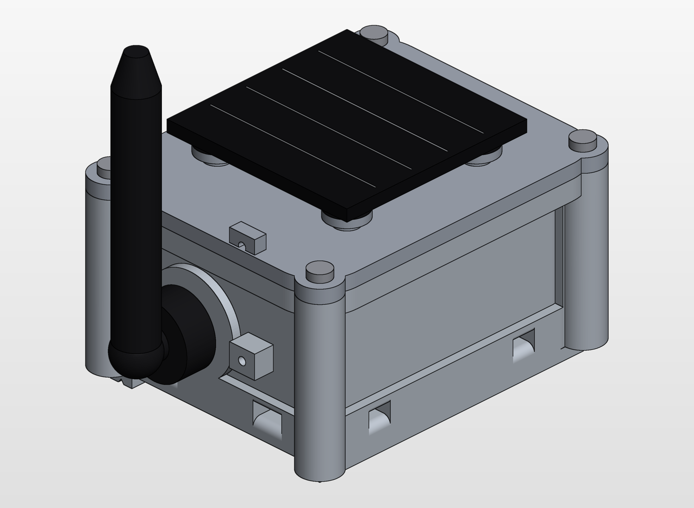

# LoRaHarvesterBox

Enclosure for the LoRaHarvesterBox PCB and an 852040 battery.

| Parameter | Value |
| --- | --- |
| Footprint | 83 × 68 mm |
| Height with skids and panel | 55.7 mm, excluding antenna and screw heads |
| Interior | 64 × 49 × 31 mm |
| PCB | 48 × 45.5 × 1.6 mm |
| Battery envelope | 45 × 20 × 8.5 mm |
| Panel envelope | 50 × 50 × 3 mm; 6 mm above the lid |
| Printed volume | 99.56 cm³ across three parts |
| Panel supports | Four Ø 10 mm bonding pads on Ø 6 mm stems; printed height 3.7 mm |
| Panel adhesive | Sikaflex, nominal 2.3 mm layer; total panel-to-lid gap 6 mm |
| Material | Light-colored SLS/MJF PA12 |
| Seal | Silicone cord Ø 3 mm, approx. 230 mm long |
| Seal groove | 4.8 mm wide, 2.3 mm deep |
| Solar feedthrough | Centered below the panel; two Ø 4 mm holes, 6 mm apart; leads up to Ø 2 mm each |
| Potting well | 14 × 8 × 2 mm; 1.8 mm walls |
| Screws | 4 × standard M3 × 10 with M3 inserts; 3 × M2 × 5 |

License: [CERN-OHL-S v2](LICENSE).
