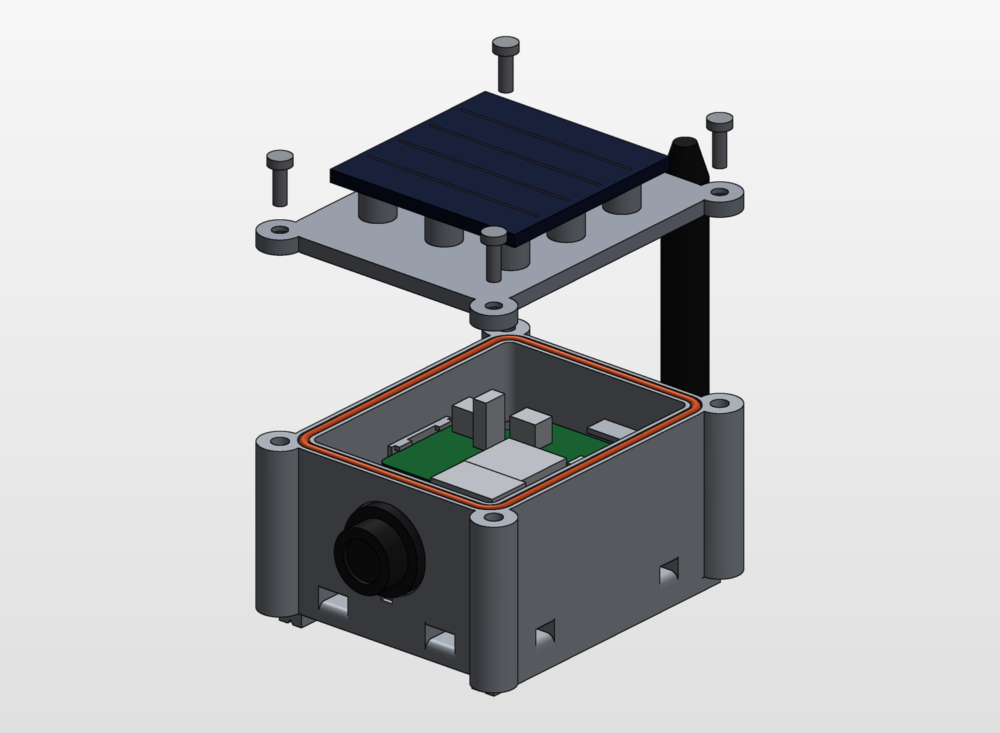
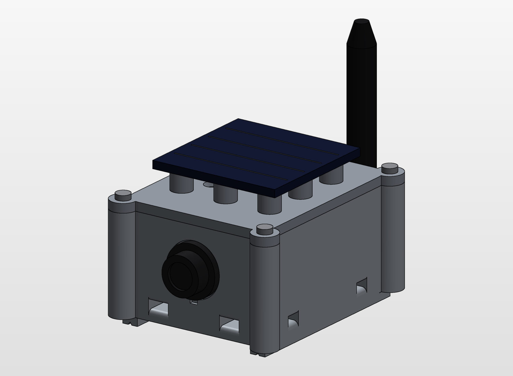
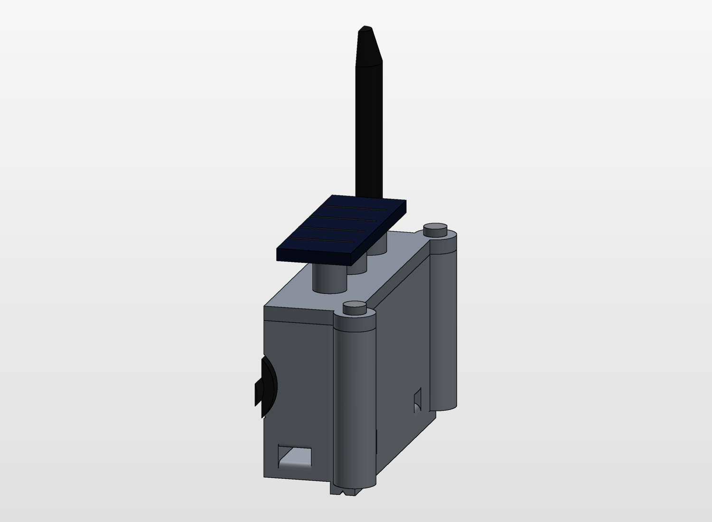
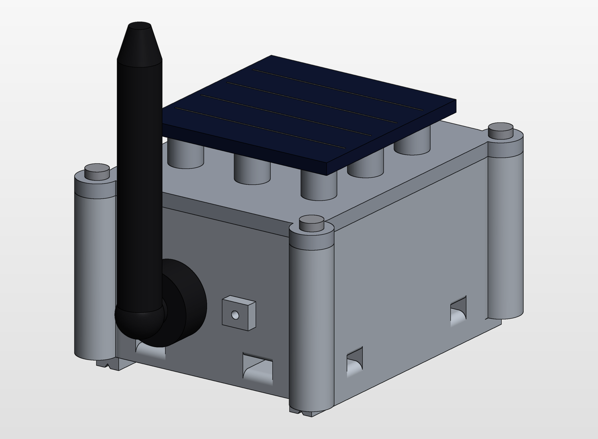

## What is this thing?

This box holds a PicoLoRaHarvester or a LoRaHarvesterbox.

## Dimensions

The body is 73.2 x 58.2 x 41.5 mm. It measures 83 x 68 mm over the screw columns and 44.5 mm over the
skids.

Two skids of 6 x 3 mm run under the floor, and each one carries a 3 x 1 mm V-groove in its face.

The inner cavity is 64 x 49 x 29 mm, and the vent chamber occupies x 56 to 64.

## Material

Bright nylon, printed by SLS or MJF. One material that JLC3DP stocks is 3301PA nylon, printed by SLS.

## Components to buy

- LiPo 852040, up to 45 mm including the protection board, with a JST-PH lead
- SMA bulkhead to U.FL pigtail, inner nose up to 20 mm, with its O-ring and at least 90 mm of cable
- Solar panel, 50 x 50 mm, bonded with epoxy or MS polymer
- ePTFE vent plug, thread 12 mm diameter and 10 mm long, head up to 20 mm, with its plastic nut
- 2 mm silicone O-ring cord, about 250 mm
- 4 M3x8 A4 screws, 1 M2x5 screw, and 4 M3 heat set inserts
- Cable ties of 5 x 1.5 mm, or cord up to 3 mm, for the lashing tunnels

## License

CERN Open Hardware Licence Version 2 - Strongly Reciprocal
